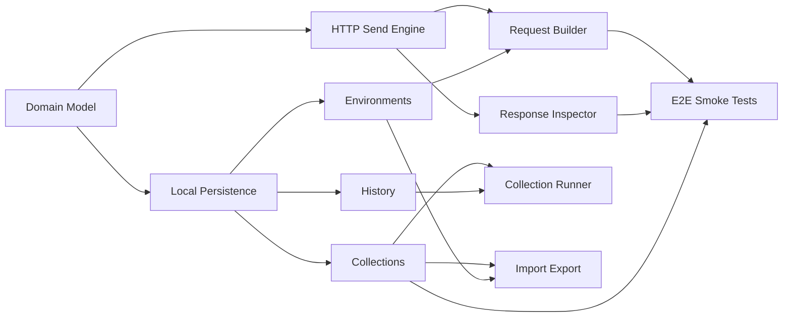

# Project Plan: Local API Workbench MVP

## 1. Project Overview

### Feature Summary

Build a local-first API testing workbench inspired by Postman. The product lets a user create HTTP requests, send them, inspect responses, organize requests into collections, manage environments/variables, run basic collection flows, and persist all data locally.

Authentication, registration, cloud sync, team collaboration, public API network, enterprise governance, billing, and remote monitoring are explicitly out of scope for this MVP.

### Business Value

- Give developers and testers a private desktop/web tool for API debugging without cloud accounts.
- Preserve repeated API workflows through local collections, history, and environments.
- Establish a scalable product foundation for later features such as mock servers, test scripts, documentation, and automation.

### Success Criteria

- User can create and send REST-style HTTP requests.
- User can inspect status, timing, response headers, response body, and request errors.
- User can save requests into collections and folders.
- User can define environments and resolve variables with `{{variable_name}}`.
- User can view request history and restore a past request.
- User data persists locally across app restarts.
- MVP can be built and run in the existing React/Tauri app.
- Core flows have unit tests and Playwright smoke coverage.

### Key Milestones

- **M1: Local Data Foundation** - Data model, local persistence, repository layer.
- **M2: API Client Core** - Request builder, send engine, response inspector.
- **M3: Collections and History** - Collection tree, saved requests, request history.
- **M4: Environments and Variables** - Environment manager and variable resolution.
- **M5: Runner and Import/Export** - Basic collection runner, JSON import/export.
- **M6: Quality and Release Hardening** - Tests, accessibility, Tauri build validation.

### Risk Assessment

| Risk | Impact | Mitigation |
| --- | --- | --- |
| Browser CORS limits request sending in web mode | High | Prefer Tauri command/native HTTP for desktop; document web limitations. |
| Local storage schema changes break saved data | High | Add versioned schema and migration layer from day one. |
| Variable resolution becomes ambiguous | Medium | Define strict scope priority and preview resolved values. |
| Request body editor grows too large | Medium | Start with raw JSON/text, form-data and urlencoded; defer code editor polish if needed. |
| Test scripting sandbox is complex | High | Defer advanced scripts; MVP runner validates status/body with simple checks only. |
| Mock server and docs compete with core client work | Medium | Keep them in later milestone or P2 scope. |

## 2. Scope

### In Scope

- Local-only workspace.
- HTTP request builder.
- Response viewer.
- Collections, folders, saved requests.
- Local environments and variables.
- Request history.
- Basic auth types: Bearer Token, Basic Auth, API Key.
- Raw JSON/text body, form-data, x-www-form-urlencoded.
- Import/export app JSON.
- Basic collection runner.
- Local persistence using IndexedDB or Tauri SQLite/plugin-backed storage.
- Existing React + Ant Design + Tauri app shell.

### Out of Scope

- Login/register.
- Cloud sync.
- Team workspace collaboration.
- Public/private API network.
- Enterprise governance.
- Remote monitors.
- AI assistant.
- Billing.
- Full Postman Collection compatibility in MVP.
- Advanced JS sandbox scripting.
- Multi-protocol support beyond HTTP/HTTPS.

## 3. Recommended Delivery Estimate

Assuming one senior full-stack/frontend engineer working in the current repo:

- **Lean MVP**: 3-4 weeks.
- **Solid MVP**: 5-6 weeks.
- **MVP + runner/import/export polish**: 7-8 weeks.

The recommended plan is **6 weeks** for a usable, tested local-first MVP.

## 4. Work Item Hierarchy

```mermaid
graph TD
    A[Epic: Local API Workbench] --> B[Feature: MVP Local Postman-like Tool]

    B --> C[Enabler: Local Persistence Architecture]
    B --> D[Enabler: HTTP Send Engine]
    B --> E[Story: Build Request Builder]
    B --> F[Story: Inspect API Responses]
    B --> G[Story: Manage Collections]
    B --> H[Story: Manage Environments]
    B --> I[Story: Track Request History]
    B --> J[Story: Run Collection Requests]
    B --> K[Story: Import and Export Data]
    B --> L[Test: MVP Quality Coverage]

    C --> C1[Task: Define data model]
    C --> C2[Task: Implement local repositories]
    C --> C3[Task: Add schema versioning]

    D --> D1[Task: Browser/Tauri HTTP adapter]
    D --> D2[Task: Normalize request and response models]
    D --> D3[Task: Error and timeout handling]

    E --> E1[Task: Method URL bar]
    E --> E2[Task: Params Headers Auth tabs]
    E --> E3[Task: Body editor]

    F --> F1[Task: Status timing header view]
    F --> F2[Task: JSON text preview]
    F --> F3[Task: Error state UI]

    G --> G1[Task: Collection tree]
    G --> G2[Task: Save request]
    G --> G3[Task: Rename duplicate delete]

    H --> H1[Task: Environment CRUD]
    H --> H2[Task: Variable resolver]
    H --> H3[Task: Active environment selector]

    I --> I1[Task: Persist send history]
    I --> I2[Task: Restore historical request]

    J --> J1[Task: Runner queue]
    J --> J2[Task: Run summary]

    K --> K1[Task: Export local workspace JSON]
    K --> K2[Task: Import local workspace JSON]

    L --> L1[Test: Unit and integration tests]
    L --> L2[Test: Playwright smoke flows]
    L --> L3[Test: Tauri build validation]
```



## 5. GitHub Issues Breakdown

### Epic Issue

```markdown
# Epic: Local API Workbench

## Epic Description

Build a local-first API testing workbench inspired by Postman. Users can create requests, send APIs, inspect responses, organize saved requests, manage local environments, and keep all data on their machine.

## Business Value

- **Primary Goal**: Provide a private local tool for repeatable API testing.
- **Success Metrics**: Core request flow completed in under 30 seconds; data persists after restart; smoke tests cover create-send-save-restore.
- **User Impact**: Developers and testers can debug APIs without account setup or cloud dependency.

## Epic Acceptance Criteria

- [ ] User can send HTTP requests from the UI.
- [ ] User can view response status, timing, headers, body, and errors.
- [ ] User can save and organize requests locally.
- [ ] User can define environments and use variables.
- [ ] User can export and import local workspace data.
- [ ] Desktop build works through Tauri.

## Features in this Epic

- [ ] Feature: MVP Local Postman-like Tool

## Definition of Done

- [ ] All MVP stories completed.
- [ ] Unit and E2E smoke tests passed.
- [ ] Local persistence migration covered.
- [ ] Documentation updated.
- [ ] Tauri build validated.

## Labels

`epic`, `priority-critical`, `value-high`

## Estimate

XL
```

### Feature Issue

```markdown
# Feature: MVP Local Postman-like Tool

## Feature Description

Deliver the first usable version of the local API workbench: request builder, response inspector, collections, environments, history, runner, and import/export.

## User Stories in this Feature

- [ ] User Story: Compose and send an HTTP request
- [ ] User Story: Inspect API responses
- [ ] User Story: Save requests into collections
- [ ] User Story: Manage local environments and variables
- [ ] User Story: Browse and restore request history
- [ ] User Story: Run saved collection requests
- [ ] User Story: Import and export workspace data

## Technical Enablers

- [ ] Technical Enabler: Local persistence architecture
- [ ] Technical Enabler: HTTP send engine
- [ ] Technical Enabler: Request/response domain model

## Dependencies

**Blocks**: Follow-up mock server, documentation generator, advanced test scripts.
**Blocked by**: Local persistence architecture, HTTP send engine.

## Acceptance Criteria

- [ ] User can create a request with method, URL, params, headers, auth, and body.
- [ ] User can send the request and inspect response details.
- [ ] User can save the request to a local collection/folder.
- [ ] User can define variables and use them in URL/headers/body.
- [ ] User can view history and restore past request state.
- [ ] User can export and import local workspace JSON.

## Definition of Done

- [ ] All user stories delivered.
- [ ] Technical enablers completed.
- [ ] Integration testing passed.
- [ ] UX review approved.
- [ ] Accessibility checks completed.

## Labels

`feature`, `priority-critical`, `value-high`, `frontend`, `tauri`

## Estimate

XL
```

## 6. Story and Enabler Inventory

| ID | Type | Title | Priority | Value | Estimate | Dependencies |
| --- | --- | --- | --- | --- | --- | --- |
| E1 | Enabler | Local persistence architecture | P0 | High | 8 | None |
| E2 | Enabler | HTTP send engine | P0 | High | 8 | E1 optional for history |
| E3 | Enabler | Request/response domain model | P0 | High | 5 | None |
| S1 | Story | Compose and send an HTTP request | P0 | High | 8 | E2, E3 |
| S2 | Story | Inspect API responses | P0 | High | 5 | E2, E3 |
| S3 | Story | Save requests into collections | P1 | High | 8 | E1, E3 |
| S4 | Story | Manage local environments and variables | P1 | High | 8 | E1, E3 |
| S5 | Story | Browse and restore request history | P1 | Medium | 5 | E1, E2, E3 |
| S6 | Story | Run saved collection requests | P2 | Medium | 8 | S1, S3, S5 |
| S7 | Story | Import and export workspace data | P2 | Medium | 5 | E1, S3, S4 |
| T1 | Test | Unit and integration coverage | P1 | High | 5 | Stories as implemented |
| T2 | Test | Playwright MVP smoke tests | P1 | High | 5 | S1-S5 |
| T3 | Test | Tauri build validation | P2 | Medium | 3 | S1-S5 |

Total estimated effort: **65 story points**. This is an XL feature and should be split across multiple sprints.

## 7. Priority and Value Matrix

| Priority | Value | Criteria | Labels |
| --- | --- | --- | --- |
| P0 | High | Critical path, required for MVP usability | `priority-critical`, `value-high` |
| P1 | High | Core user-facing workflow | `priority-high`, `value-high` |
| P1 | Medium | Important workflow support | `priority-high`, `value-medium` |
| P2 | Medium | Important but can ship after first MVP cut | `priority-medium`, `value-medium` |
| P3 | Low | Nice to have or polish | `priority-low`, `value-low` |

## 8. Dependency Management



### Critical Path

1. Request/response domain model.
2. Local persistence architecture.
3. HTTP send engine.
4. Request builder.
5. Response inspector.
6. Collections and environments.
7. History.
8. Import/export and runner.
9. Test and release hardening.

## 9. Sprint Planning

### Sprint 1 Goal

**Primary Objective**: Build the foundation and prove one request can be sent.

**Stories in Sprint**:

- E3 - Request/response domain model (5 pts)
- E1 - Local persistence architecture (8 pts)
- E2 - HTTP send engine (8 pts)
- Partial S1 - Method URL bar and send action (3 pts)

**Total Commitment**: 24 story points.

**Success Criteria**: A user can send a simple GET request and see normalized response data in development.

### Sprint 2 Goal

**Primary Objective**: Complete core request/response workflow.

**Stories in Sprint**:

- S1 - Compose and send an HTTP request (remaining 5 pts)
- S2 - Inspect API responses (5 pts)
- Partial S5 - Save request history after sends (3 pts)
- T1 - Initial unit/integration coverage (3 pts)

**Total Commitment**: 16 story points.

**Success Criteria**: User can configure params, headers, auth, body, send request, and inspect response status, timing, headers, and body.

### Sprint 3 Goal

**Primary Objective**: Make requests reusable through collections and environments.

**Stories in Sprint**:

- S3 - Save requests into collections (8 pts)
- S4 - Manage local environments and variables (8 pts)
- S5 - Browse and restore request history (remaining 2 pts)
- T2 - Playwright smoke tests for core flows (3 pts)

**Total Commitment**: 21 story points.

**Success Criteria**: User can save requests, organize folders, select an environment, resolve variables, and restore request history.

### Sprint 4 Goal

**Primary Objective**: Add MVP automation and release hardening.

**Stories in Sprint**:

- S6 - Run saved collection requests (8 pts)
- S7 - Import and export workspace data (5 pts)
- T1 - Remaining test coverage (2 pts)
- T2 - Remaining E2E coverage (2 pts)
- T3 - Tauri build validation (3 pts)

**Total Commitment**: 20 story points.

**Success Criteria**: User can export/import data, run a saved collection, and the app passes release smoke tests.

## 10. GitHub Project Board Configuration

### Columns

1. Backlog
2. Sprint Ready
3. In Progress
4. In Review
5. Testing
6. Done

### Custom Fields

- Priority: P0, P1, P2, P3
- Value: High, Medium, Low
- Component: Frontend, Tauri, Data, Testing
- Estimate: Story points or t-shirt size
- Sprint: Sprint 1, Sprint 2, Sprint 3, Sprint 4
- Epic: Local API Workbench

## 11. Definition of Ready

- Acceptance criteria are testable.
- Dependencies are identified.
- UI state and data model impact are clear.
- Error handling expectations are defined.
- Estimate is assigned.
- Story can be completed within one sprint or split.

## 12. Definition of Done

- Acceptance criteria met.
- Code reviewed.
- Unit tests added for domain logic and repositories.
- Integration tests added for request send and persistence flows.
- Playwright smoke coverage added for critical user journeys.
- Accessibility basics checked: keyboard navigation, visible focus, labels.
- Local data persists across reload/restart.
- No unrelated regressions in existing auth/orders app routes.
- Documentation updated.

## 13. Follow-Up Epics

These should not block MVP:

- Mock server.
- Documentation generator.
- Advanced test scripts and sandbox.
- Postman Collection v2.1 compatibility.
- OpenAPI import.
- Local monitors/scheduled runs.
- Visual Flows.
- Git sync.
- AI assistant.
